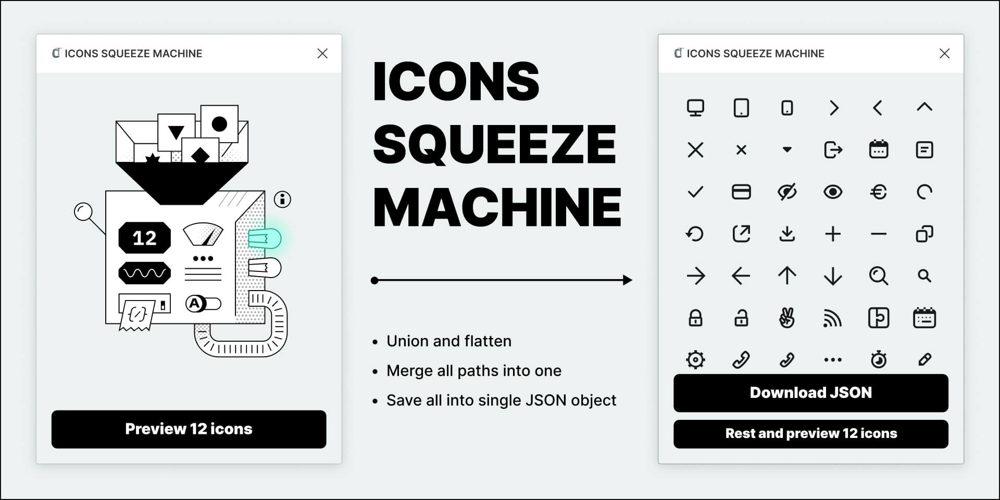
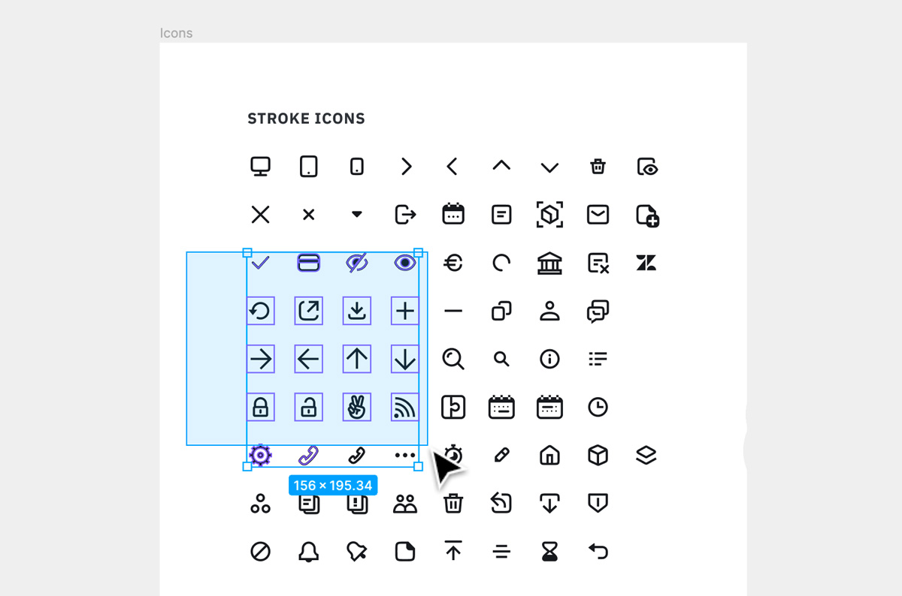

# 🗜️ Icons Squeeze machine



A Figma plugin that allows you to merge multiple `SVG` paths into a single one for selected icons and then save them as a `JSON` file.

---

## 🕹 [Install plugin](https://www.figma.com/community/plugin/961245776147091630/ICONS-SQUEEZE-MACHINE)

#### 🤖 [Icons to test](https://www.figma.com/file/r5TqC09BRHtNanD8vSBkqA/%F0%9F%97%9C%EF%B8%8F-Icons-Squeeze-machine-TEST-ICONS?node-id=1%3A768)

#### 📺 [Youtube demo](https://youtu.be/po-FzKP7wjc)

---

## What is the plugin for

In case if you use icons in a project as an `Icon` component, important to store all assets in one place and as compact as possible. In this case it better to load only one `path d` instead of store multiple paths for one SVG icon.

**If you not familiar with the method [check this article](https://david-gilbertson.medium.com/icons-as-react-components-de3e33cb8792)**

So the plugin cuts the chain ⛓️: **_export icons → load to icomoon.io → export and save font → extract `JSON` → clean it. 🏁_**

With the plugin the chain should be ⛓️: **_export icons. 🏁_**

---

## How it works

For example let's take this `calendar` icon:


The full `SVG` code for it will be:

```svg
<svg width="24" height="24" viewBox="0 0 24 24" fill="none" xmlns="http://www.w3.org/2000/svg">
<path d="M8 15C8.55228 15 9 14.5523 9 14C9 13.4477 8.55228 13 8 13C7.44772 13 7 13.4477 7 14C7 14.5523 7.44772 15 8 15Z" fill="#17191C"/>
<path d="M12 15C12.5523 15 13 14.5523 13 14C13 13.4477 12.5523 13 12 13C11.4477 13 11 13.4477 11 14C11 14.5523 11.4477 15 12 15Z" fill="#17191C"/>
<path d="M17 14C17 14.5523 16.5523 15 16 15C15.4477 15 15 14.5523 15 14C15 13.4477 15.4477 13 16 13C16.5523 13 17 13.4477 17 14Z" fill="#17191C"/>
<rect x="7" y="1" width="2" height="2" fill="#17191C"/>
<rect x="15" y="1" width="2" height="2" fill="#17191C"/>
<path fill-rule="evenodd" clip-rule="evenodd" d="M2 7C2 4.79086 3.79086 3 6 3H7V5H9V3H15V5H17V3H18C20.2091 3 22 4.79086 22 7V17C22 19.2091 20.2091 21 18 21H6C3.79086 21 2 19.2091 2 17V7ZM4 9V17C4 18.1046 4.89543 19 6 19H18C19.1046 19 20 18.1046 20 17V9H4Z" fill="#17191C"/>
</svg>
```

The shortened code by the plugin will be:

```svg
"M8 15C8.55228 15 9 14.5523 9 14C9 13.4477 8.55228 13 8 13C7.44772 13 7 13.4477 7 14C7 14.5523 7.44772 15 8 15Z M12 15C12.5523 15 13 14.5523 13 14C13 13.4477 12.5523 13 12 13C11.4477 13 11 13.4477 11 14C11 14.5523 11.4477 15 12 15Z M16 15C16.5523 15 17 14.5523 17 14C17 13.4477 16.5523 13 16 13C15.4477 13 15 13.4477 15 14C15 14.5523 15.4477 15 16 15Z M9 1H7V3H6C3.79086 3 2 4.79086 2 7V17C2 19.2091 3.79086 21 6 21H18C20.2091 21 22 19.2091 22 17V7C22 4.79086 20.2091 3 18 3H17V1H15V3H9V1ZM9 3V5H7V3H9ZM4 17V9H20V17C20 18.1046 19.1046 19 18 19H6C4.89543 19 4 18.1046 4 17Z M15 3V5H17V3H15Z"
```

---

## How to use

1. Run the plugin.
2. Select your icons set.
   Important — icons should be selected, not the only one frame where they are. In this case the plugin will try to merge all icons into one within this frame.
3. Click on the `Preview` button.
4. Check that all icons are displayed as they should.
5. Click on the `Download JSON` button.

Plugin will generate `ZIP` folder with `JSON` file and `HTML` file that will preview all icons from the saved `JSON`.

---

## Possible issues

- **Failed union Boolean operation.** Icon elements were merged incorrectly. Solution — fix paths manually — flatten paths and outline curves.

- **You selected a frame with icons but not icons**. Please, note that you need to select icons, not the parent frame.



---
